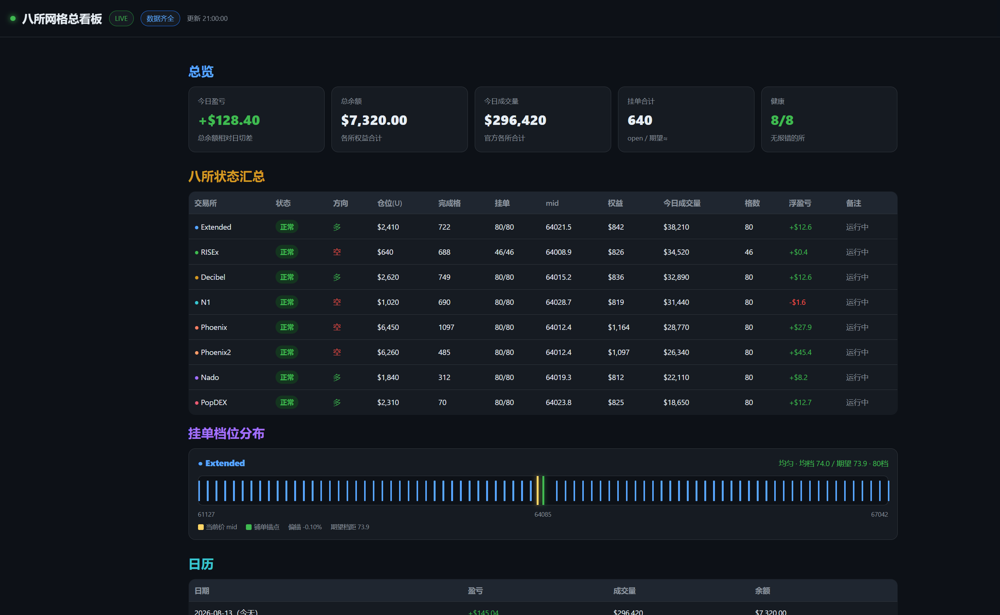

# Classic Grid — 五所经典网格（开源）

[](./LICENSE)
[](./package.json)
[](https://twitter.com/aiqiang888)

等差网格：现价下买上卖，**成交后补相邻反向单**；启动校验格距 > 双边手续费、保证金预检。

适配器：**Extended · RISEx · Decibel · N1 · Phoenix**

> 开源模板，**不含私钥 / API Key / 服务器地址 / 真实账本**。  
> 演示图均为脱敏示例数据。推特：[@aiqiang888](https://twitter.com/aiqiang888)



---

## 注册链接

| 交易所 | 链接 |
|--------|------|
| **Decibel** | https://app.decibel.trade/r/K7B2QM |
| **Phoenix** | https://phoenix.trade/?code=YNS0TXV0 |
| **Extended** | https://app.extended.exchange/join/AIQIANG888 |
| **N1** | https://app.n1.xyz/r/orderly-loop-curve |
| **RISEx** | https://rise.trade/（暂无推荐码） |

---

## 功能一览

- 多所统一 `VenueExecutor`：`snapshot` / `apply` / 可选 `cancelAll`·`closePosition`
- 经典网格核心：`seed` 铺单 + 成交补反向档 + `skipBand`
- 本地看板：总览 KPI、今日明细、四所状态、挂单档位横轴（看匀不匀）
- 官方量 / 费 / 平仓盈亏（节流拉取，避免内存爆）
- Telegram：开/平简报、整点总览（可选）
- `SOFT_RESUME`：重启恢复锚点，避免误整表撤单

---

## 我们解决过什么（摘要）

完整版 → [`docs/CHALLENGES.md`](./docs/CHALLENGES.md)

| 难题 | 解法要点 |
|------|----------|
| 成交后网格断档 | 买→上邻卖 / 卖→下邻买，每 level 一单 |
| 重启冲掉挂单 | `SOFT_RESUME` + 本地锚点，只补漏 |
| 官方统计 OOM | 2 分钟节流 + 加大 Node 堆；展示≠轻量拉取 |
| 各所盈亏口径不一 | Ex 用已平仓 history；Rise/Dec 用 fill realized 等 |
| 仓位名义差很多 | 多为净仓路径不同，先对满格名义再对净格数 |
| 限流 / 挂单上限 | `maxOpenOrders`、写频、间隔、错误去重 |
| Decibel tick/lot | 编码前对齐 |
| mid「缺一档」惊吓 | 买卖分界缝，不是漏单 |

---

## 给 AI / 开发者

1. `npm install` → 复制 `.env.example` 为 `.env`（只填本机密钥）
2. 默认 `DRY_RUN=1`；实盘需用户明确：`DRY_RUN=0` + `LIVE_CONFIRM=YES`
3. 策略：`src/grid.ts` · 循环：`src/loop.ts` · 适配器：`src/venues/`
4. 看板：`npm run dashboard` 或随 `npm start` → `http://127.0.0.1:8088/api/snapshot`
5. 演示页（脱敏）：打开 `docs/demo-dashboard.html`
6. **禁止**提交 `.env` / `secrets/` / `data/`；见 [`SECURITY.md`](./SECURITY.md)

```bash
npm install
cp .env.example .env
npm test
DRY_RUN=1 npm start -- --once
```

Windows：

```powershell
$env:DRY_RUN="1"; npm start -- --once
```

---

## 默认参数（可改）

| 所 | 格数 | 杠杆 | 备注 |
|----|------|------|------|
| Extended | 80 | 30x | 半幅约 ±4.6% |
| Decibel / N1 | 65 | 30x | 同上 |
| RISEx | 46 | 25x | 半幅约 ±3% |
| Phoenix | config / env | env | Solana 永续 |

`GRID_MARGIN_FRAC` 默认 `0.7`。

---

## 目录

```
src/grid.ts venues/ loop.ts dashboard.ts officialStats.ts telegram.ts
public/index.html
docs/CHALLENGES.md demo-dashboard.html images/
vendor/   # 轻量封装，无密钥
test/
```

---

## 免责声明

杠杆与合约有爆仓风险；软件按现状提供。推荐链接非投资建议。切勿在 Issue 粘贴私钥。

## License

MIT · 推特 [@aiqiang888](https://twitter.com/aiqiang888)
